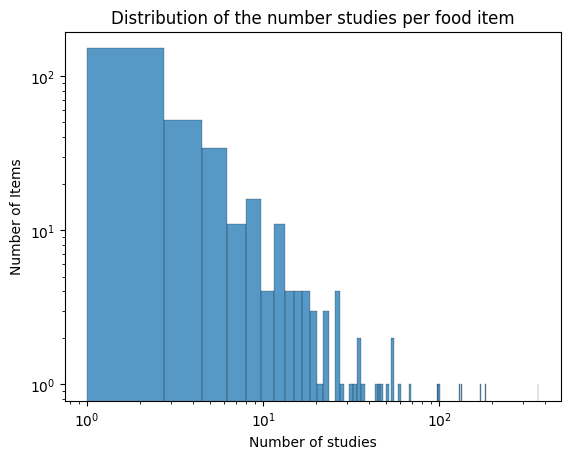
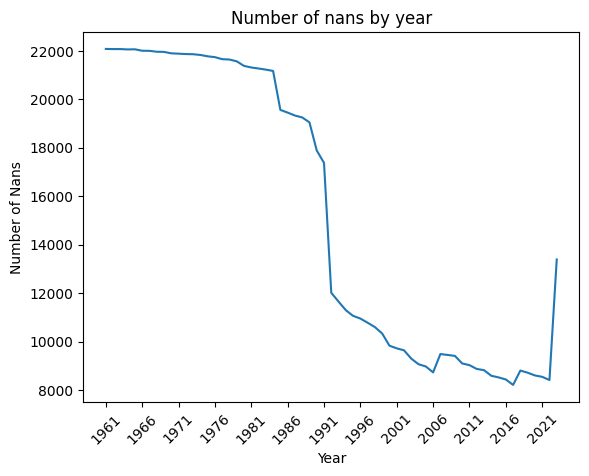

# Project of Data Visualization (COM-480)

| Student's name | SCIPER |
| -------------- | ------ |
|Ariane Augustoni | 376345|
|John Taylor | 302347|
|Louis Litzler-Italia |330718 |

[Milestone 1](#milestone-1) • [Milestone 2](#milestone-2) • [Milestone 3](#milestone-3)

## Milestone 1 (21st March, 5pm)

**10% of the final grade**

### Dataset
This project uses two dataset on food impacts :

The first one was created by (Petterson et al. 2021) ["A multilevel carbon and water footprint dataset of food commodities"](https://www.nature.com/articles/s41597-021-00909-8). It's a dataset reviewing the literature on the carbon and water footprint of different food commodities. The output is an excel file giving the mean carbon footprint of aliment in CO2eq/g, and the water footprint in liters of water/kg across the studies. The foods are categorized by typologies and subtypologies. Additionnal information about the studies and some basic statistic across studies are also available. 
In our project this dataset is the excel "SuEatableLife_Food_Fooprint_database.xlsx" and is accessible in our data folder.

The second dataset comes from the [Food and Agriculture Organization of the United Nations](https://www.fao.org/faostat/en/#data/QCL). The dataset compiles crop and livestock statistics for 278 products wordlwide since 1961. It contains information about the area harvested, yield, production, stocks, and the number of producing animals slaugthered. More details can be found in the [agricultural production statistic report](https://openknowledge.fao.org/items/ab36b259-d641-4ded-8832-32f579685be7)

The two datasets are of high quality and don't require lots of pre-processing.

Another idea — though access to the necessary data is still uncertain — is to use PSILCA, a social life cycle assessment tool, to evaluate the social impact of common food products. This would allow us to incorporate social sustainability factors into our visualizations, complementing the environmental aspects. This tool includes indicators about child labour, forced labour, fair salary, working time, and many others. A similar approach was used in a paper by (Mancini et al. 2023) ["Social footprint of European food production and consumption"](https://www.sciencedirect.com/science/article/pii/S2352550922003013).

### Problematic

> What are we trying to show with our visualization?

The goal of this project is to highlight the environmental, social, and ethical impacts of different food products through engaging data visualizations. By combining data on carbon and water footprints with production, yield, social impact, number of slaughtered animals and other relevant factors, we aim to present a clear and intuitive way to understand which foods have the highest and lowest impacts.

> Think of an overview for the project, your motivation, and the target audience.

This project will take the form of an interactive website designed to serve as a practical guide for responsible grocery shopping. It will feature:

- Data visualizations showcasing high- and low-impact foods, using intuitive design elements like food icon scaling.
- An interactive basket tool (with a limited number of food products), where users can build their grocery list and see real-time visualizations and feedback on the environmental and social impact of their choices.

The motivation is to raise awareness about the hidden impacts of food consumption, to challenge common misconceptions, and provide a user-friendly tool for making more informed choices. The target audience includes urban consumers who shop primarily in supermarkets, though the insights are valuable for anyone looking to rethink their consumption habits. The ultimate aim is to empower individuals to make more sustainable choices while making the learning process engaging and accessible.

### Exploratory Data Analysis

> Pre-processing of the data set you chose
> - Show some basic statistics and get insights about the data

The preliminary analysis of the datasets have been done in the following [notebook](exploratory_analysis.ipynb)

**Carbon and Water Footprint Datasets**

The dataset provides comprehensive information about the **carbon footprint (CF)** and **water footprint (WF)** of a wide range of food items.

- The carbon footprint dataset contains **324 items**, grouped into **80 common food typologies**.  
- The water footprint dataset comprises **320 items**, categorized into **72 food typologies**.  

To better understand the magnitude of the footprints, we provided some basic statistics:

| WF Statistic | Liters of Water per kg/L of Food Item | cc of Water per g/cc of Food Typology |
|-------------|---------------------------------------|---------------------------------------|
| Mean        | 7,456.48                              | 4,097.34                               |
| Std Dev     | 41,948.79                             | 6,651.85                               |
| Min         | 41.00                                 | 51.00                                  |
| Mean      | 2,080.00                              | 2,133.00                               |
| Max         | 731,000.00                            | 51,779.00                              |

| CF Statistic | kg CO₂eq per kg/L of Food Item | g CO₂eq per g/cc of Food Typology |
|-------------|--------------------------------|----------------------------------|
| Mean        | 3.10                           | 2.86                             |
| Std Dev     | 5.76                           | 5.29                             |
| Min         | 0.109                          | 0.270                            |
| Mean   | 1.376                          | 1.437                            |
| Max         | 78.80                          | 78.80                            |

---

Each footprint measurement is based on data from multiple studies. Below is the distribution of the number of studies per food item from the carbon footprint dataset:

  

- The plot is displayed on a log-log scale and appears to follow an **inverse power law distribution**.  
- Roughly **30% of all items are covered by only one study** regarding their carbon footprint.  

> FAO Dataset

The dataset covers yearly production data from 1961 to 2023, spanning 245 areas that include individual countries, smaller regions (like islands), and aggregated groups (such as continents or global totals).

In total, the dataset contains production information for 301 distinct food items.

The dataset captures various types of production data, distributed as follows:

| Production Type                      | Percentage of Entries |
|--------------------------------------|-----------------------|
| Production                           | 0.397930%              |
| Area harvested                       | 0.220079%              |
| Yield                                | 0.212237%              |
| Producing Animals/Slaughtered         | 0.071138%              |
| Stocks                               | 0.041242%              |
| Yield/Carcass Weight                  | 0.039695%              |
| Milk Animals                         | 0.010694%              |
| Laying                               | 0.006985%              |

To better understand data completeness over time, the following plot illustrates the yearly distribution of missing data

   

### Related work

> What others have already done with the data?

- The website [SU-EATABLE Life](https://www.sueatablelife.eu/en/the-earth-recommends/index.html) present some visualisation and statistiques on the first dataset.
- The Food and Agriculture Organization of the United Nations already made plenty visualizations with their dataset that can be found [here.][https://ourworldindata.org/agricultural-production#article-licence]

> Why is our approach original?

Our project stands out because it goes beyond environmental impact to include social and ethical concerns, which are often overlooked in available resources. While many existing tools focus primarily on carbon footprints or water use, we aim for a more holistic perspective, integrating factors like labour conditions, animal treatment conditions, fair trade, and ethical considerations in food production. While some scientific articles take into account the interactions of those complex factors (Mancini et al. 2023) it's hard to find nice visual representations showing the complexity of "food ethics".

Additionally, our approach is:

- Interactive and personalized: Instead of just presenting data, users can build a grocery basket and instantly visualize the impact of their choices.
- Visually intuitive: Using elements like scaled food icons based on impact makes complex data easy to grasp at a glance.
- Action-oriented: Rather than just raising awareness, we provide a practical tool that helps users rethink their grocery habits in a meaningful way.

While originality is valuable, in this case, the main goal is not to reinvent the wheel but to create something impactful and accessible using already existing data and studies.

> Sources of inspiration:

- A website on the carbon footprint of aliments : https://www.inc-conso.fr/content/quel-est-limpact-carbone-de-votre-alimentation
- water footprint calculator : https://watercalculator.org/wfc2

## Milestone 2 (18th April, 5pm)

**10% of the final grade**

## Milestone 3 (30th May, 5pm)

**80% of the final grade**

## Late policy

- < 24h: 80% of the grade for the milestone
- < 48h: 70% of the grade for the milestone

[https://ourworldindata.org/agricultural-production#article-licence]: https://ourworldindata.org/agricultural-production#article-licence
1. Petersson, Tashina; Secondi, Luca; Magnani, Andrea; Antonelli, Marta; Dembska, Katarzyna; Valentini, Riccardo; et al. (2021). SU-EATABLE LIFE: a comprehensive database of carbon and water footprints of food commodities. figshare. Dataset. https://doi.org/10.6084/m9.figshare.13271111.v2
2. FAO. 2024. Agricultural production statistics 2010–2023. FAOSTAT Analytical Briefs, No. 96. Rome.
